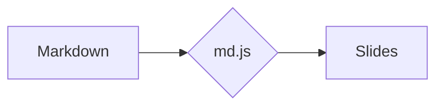

# Building MDECK presentations

MDECK is a zero-build static slide engine: **one folder per presentation, one `.md` file per slide**. It renders Markdown with markdown-it + highlight.js and adds per-slide frontmatter, `:::` layout containers, inline icons/keys, and on-demand Mermaid diagrams + KaTeX math. Author content only — never hand-write HTML for slides.

This skill works in **either kind of repo**:

- **The MDECK engine repo itself** — the viewer and styles live in `assets/`, and there are example decks under `presentations/`.
- **Your own content repo** — your presentations plus two thin `deck.html` / `index.html` pages that load the engine from a CDN (jsDelivr). There is no `assets/` engine source here; you only ever touch `presentations/`.

Either way the slide syntax below is identical. Work out which one you're in by checking whether `assets/md.js` exists (engine repo) or `deck.html` pulls scripts from `cdn.jsdelivr.net` (content repo).

## Workflow to create a deck

1. **Make a folder** under `presentations/`, e.g. `presentations/intro-git/`. Use a kebab-case, URL-safe id (letters, digits, `-`, `_` only — the engine rejects anything else).
2. **Write `presentation.json`** in that folder (see schema below).
3. **Write the slides** as `NN-name.md` files (zero-padded order prefix), one per slide.
4. **Register the deck** in `presentations/index.json` — add the folder id to the flat `presentations` list or to a collection's `presentations` list.
5. **Preview**: `python -m http.server 8080` then open `http://localhost:8080/deck.html?p=<folder>`. Slides are loaded via `fetch()`, so it must be served over HTTP, never opened as `file://`.

A ready-to-copy starter is in this skill's `template/` folder — copy it into `presentations/<id>/` and adapt.

### presentation.json

```json
{
  "title": "Introduction to Git",
  "description": "Version control for beginners.",
  "accent": "violet",
  "tags": ["Git", "Course"],
  "slides": ["01-title.md", "02-concepts.md", "03-final.md"]
}
```

`slides` is the ordered list of files to load — it is the source of truth for order, not the filenames. `accent` is the deck-wide default accent; individual slides can override it.

## The single most important authoring rule

Slides are a **fixed 1280×720 stage** (16:9), scaled to the viewport. **Content does NOT shrink to fit** — anything too tall visibly overflows the bottom edge. So keep each slide light:

- One idea per slide. Prefer a title + ~3–6 bullets, or one code block, or one container row.
- Bullets short (one line each). Body paragraphs a sentence or two.
- Code blocks: ≲ 12 lines, and keep lines short (no horizontal scroll — `pre` hides overflow).
- If content doesn't fit, **split it across two slides** rather than cramming.

When in doubt, preview and check nothing spills past the bottom.

## Slide frontmatter

Optional YAML-ish block at the very top of a slide file:

```markdown
---
layout: title        # see layouts below (omit for the default body layout)
accent: indigo       # teal | indigo | violet | amber | rose | emerald | sky
image: cover.jpg     # only for layout: full-image — path relative to the deck folder, or a full URL
---
```

### Layouts

| `layout:` | Use for |
|-----------|---------|
| *(omit)* / `default` | Normal content slide (eyebrow + `##` title + body). |
| `title` | Opening slide — huge `#` title on solid ultramarin. |
| `section` | Section divider — large `#` with a gold rule. |
| `center` | Vertically + horizontally centered content. |
| `quote` | Big centered pull-quote: a `>` blockquote + a `— Attribution` line. |
| `full-image` | Full-bleed background image (set `image:`), title overlaid at the bottom. |
| `end` / `thanks` | Closing slide on solid ultramarin, centered. |

Typical deck shape: `title` → content/`section` slides → `end`.

## Markdown body

Standard CommonMark + GFM tables + autolinks:

- `**bold**`, `*italic*`, `` `inline code` ``, `[links](https://…)` (open in a new tab).
- `######` (h6) renders as a small uppercase **eyebrow** label above the title.
- `##` is the normal slide title (gets an accent underline); `#` is reserved for title/section/end layouts.
- `-` / `1.` lists, `>` blockquotes, `| tables |`, `---` rules, `` images.
- Fenced code with a language gets highlighted: ` ```sql `, ` ```python `, ` ```js `, ` ```bash `, ` ```powershell `, `json`, `html`, `css`, `csharp`, `java`, … A language the engine doesn't bundle simply renders unhighlighted; adding one is an engine-side change (drop its highlight.js file into the engine's `assets/vendor/languages/` and include it in `deck.html`).

## Layout containers (`:::`)

Open with `::: <kind> [arg]`, close with a bare `:::`. They nest. Empty `:::` closes the most recently opened container.

```markdown
::: grid 3
::: card teal
### Card title
Content — lists work too.
:::
::: stat violet
## 250+
Label under the number
:::
:::
```

| Container | What it does |
|-----------|--------------|
| `grid 2` / `3` / `4` … | Equal columns (1–6). |
| `grid 1-2` / `1-2-1` | **Proportional** columns (`fr` units from the hyphen spec). |
| `cols N` | Alias of `grid N`. |
| `card <accent>` | Bordered card with an accent top stripe. |
| `stat <accent>` | Big number (`##`) + small uppercase label (paragraph). |
| `split` + `col` | Two halves, vertically centered — put two `::: col` blocks inside (text next to media/code). |
| `columns 2` / `3` | Body text flowing across newspaper-style columns. |
| `timeline` | Vertical timeline built from a `-` list; lead each item with `**bold**`. |
| `steps` | Numbered step cards side by side, built from an ordered (`1.`) list. |
| `callout info` / `tip` / `ok` / `warn` | Colored note box with an icon (blue / violet / green / red). |

Accents available everywhere: `teal`, `indigo`, `violet`, `amber`, `rose`, `emerald`, `sky`.

## Inline extras

- **Icons** — `:name:` renders a small SVG tinted with the slide accent. Available: `check`, `x`, `star`, `arrow`, `zap`, `info`, `alert`, `heart`, `rocket`, `code`, `database`, `leaf`, `clock`, `users`, `lock`, `chart`, `bulb`, `flag`, `mail`, `calendar`, `target`, `globe`. Unknown `:names:` are left as plain text (so ordinary colons are safe).
- **Keys** — `[[Ctrl]]`, `[[Space]]`, `[[→]]` render as styled `<kbd>` chips.

## Diagrams and math (loaded on demand)

Both libraries are vendored locally and only fetched when a slide actually uses them, so plain decks stay lean.

Mermaid — a fenced `mermaid` block:

````markdown

````

KaTeX — `$inline$` and `$$display$$`:

```markdown
Inline $e^{i\pi}+1=0$, and a display block:

$$ \sigma = \sqrt{\tfrac{1}{N}\sum_{i=1}^{N}(x_i-\mu)^2} $$
```

Math is extracted before Markdown runs, so LaTeX `_ * < {}` are safe. Dollar signs inside code spans/fences are ignored. Keep diagrams small so they fit the stage.

## Registering in index.json

Flat list, or grouped into collections:

```json
{
  "collections": [
    { "title": "Course 2026", "description": "optional", "presentations": ["intro-git", "intro-sql"] }
  ],
  "presentations": ["demo"]
}
```

Order of collections and ids is the display order. A plain `{ "presentations": [...] }` (no collections) renders one ungrouped grid. Decks left out of both lists won't appear on the home page (but are still reachable by URL).

## Conventions and tips

- **Match the existing decks.** If `presentations/` already has decks, open one or two first and mirror their voice, slide count, and structure. (In the engine repo, `presentations/demo/` is a slide-by-slide tour of every feature — a good reference.)
- **Filenames:** `NN-short-name.md`, with a two-digit prefix matching the `slides` order in `presentation.json`.
- **Don't restyle from slides.** Colors, fonts, layouts and containers are defined by the engine's CSS/JS — author with the building blocks above instead of inlining HTML or `<style>`. If a layout or container you need doesn't exist, that's an engine change (in the MDECK repo's `assets/`), not something to fake inside a slide.
- **Customizing the look** (optional, for a content repo): the title/accent palette, fonts and UI strings can be overridden via `window.MDECK = { author, monogram, strings, … }` set **before** the engine scripts in your `deck.html` — see the engine's README. The slide-authoring syntax stays the same.
- **Always verify:** serve the repo over HTTP (`python -m http.server 8080`), step through the deck, and confirm no slide overflows the bottom and that any diagrams/math render. Never open slides as `file://` — `fetch()` is blocked.
