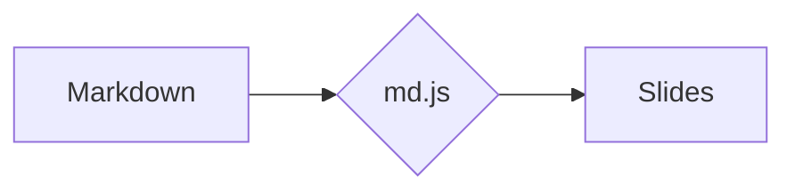

# MDECK — Markdown slide decks for the web

Zero-build, 100% static presentation engine (HTML + CSS + JavaScript). Each presentation is a **folder**, each slide is a **Markdown file**. Serve it from any static host — GitHub Pages, an intranet share, `python -m http.server` — and it just works.

- ✍️ **Write slides in plain Markdown** — one `.md` file per slide, versioned in git like the rest of your code
- 🚀 **No build step, no dependencies to install** — markdown-it and highlight.js are vendored locally, so it works fully offline / on intranets, no CDN required
- 🗂️ **Library home page with collections** — group decks by topic, course, or team
- 🎨 **Opinionated, polished look** — accent colors, dark mode, layout containers (grids, cards, stats)
- 🖥️ **Presenter-friendly** — keyboard navigation, overview grid, fullscreen, touch swipe, deep links to any slide, print-to-PDF export
- 🔌 **Embeddable engine** — keep your content in a separate (even private) repo and load the engine from a CDN

This repo contains the **engine** only: the viewer, the home page, the styles, and a `demo/` presentation as an example. Real content lives in separate repos that consume the engine — see [Embedding](#embedding-using-the-engine-from-another-repo).

Markdown is rendered with [markdown-it](https://github.com/markdown-it/markdown-it) (CommonMark + GFM tables + linkify) and code is highlighted with [highlight.js](https://highlightjs.org/) — both **vendored locally** in `assets/vendor/`. `assets/md.js` is just a thin adapter that adds per-slide frontmatter and `:::` containers.

## Structure

```
mdeck/
├── index.html                  # home page (the presentation library)
├── deck.html                   # universal viewer: deck.html?p=<folder>
├── assets/
│   ├── style.css               # visual identity + home page
│   ├── deck.css                # viewer styles
│   ├── home.js                 # home page logic
│   ├── deck.js                 # viewer logic
│   ├── md.js                   # Markdown adapter (frontmatter, containers, icons, math)
│   └── vendor/                 # markdown-it, highlight.js, mermaid, katex (local)
├── presentations/
│   ├── index.json              # list / collections of presentations
│   └── demo/                   # example — delete or replace it
└── .claude/skills/mdeck-deck/  # Claude Code skill for authoring decks (see below)
```

## Getting started

Markdown files are loaded via `fetch()`, so the page must be served over HTTP (not opened directly via `file://`):

```powershell
python -m http.server 8080
# or
npx serve .
```

Then open **http://localhost:8080**.

## Embedding (using the engine from another repo)

A content repo only needs the presentations plus two thin HTML pages that load the engine from here. Assets can be served straight from GitHub via [jsDelivr](https://www.jsdelivr.com/):

```
https://cdn.jsdelivr.net/gh/ovidiuchis/mdeck@main/assets/...
```

Structure of a content repo:

```
content-repo/
├── index.html        # thin copy — CSS/JS from CDN
├── deck.html         # thin copy — CSS/JS from CDN
└── presentations/
    ├── index.json
    └── my-presentation/...
```

In the content repo's `deck.html` and `index.html`, replace the local `assets/...` references with the CDN URLs and, optionally, set the configuration **before** the engine scripts:

```html
<script>
  window.MDECK = {
    root: "presentations/",   // presentations folder (default)
    home: "index.html",       // home page (default)
    author: "Jane Doe",       // signature on the first/last slide (default: none)
    monogram: "JD",           // signature monogram (default: author's initials)
    strings: {                // UI text overrides (default: English)
      backToList: "Înapoi la lista de prezentări",
      open: "Deschide"
      // see the STR tables in home.js / deck.js for all keys
    }
  };
</script>
<script src="https://cdn.jsdelivr.net/gh/ovidiuchis/mdeck@main/assets/deck.js"></script>
```

Complete example of a content repo: [oc-prezentari](https://github.com/ovidiuchis/oc-prezentari).

> **Note:** jsDelivr caches `@main` for up to 12 hours. For stable releases, reference a tag or a commit: `...@v1.0/assets/...`.

Alternatives to the CDN: include this repo as a **git submodule** (relative references `mdeck/assets/...`) or simply **copy** the `assets/` folder.

## Adding a new presentation

1. Create a new folder in `presentations/`, e.g. `presentations/intro-git/`.
2. Add a `presentation.json`:

```json
{
  "title": "Introduction to Git",
  "description": "Version control for beginners.",
  "accent": "violet",
  "tags": ["Git", "Course"],
  "slides": ["01-title.md", "02-concepts.md", "03-final.md"]
}
```

3. Write the slides as `.md` files (see the syntax below).
4. Add the folder name to `presentations/index.json` — either in the flat `presentations` list or inside a collection (see below).

Done — it shows up automatically on the home page.

## Collections

Presentations can be grouped on the home page into **collections** (e.g. "Internship 2026", "Company general"). In `presentations/index.json`:

```json
{
  "collections": [
    {
      "title": "Internship 2026",
      "description": "Materials for the internship program.",
      "presentations": ["intro-git", "intro-sql"]
    },
    {
      "title": "Company general",
      "presentations": ["onboarding"]
    }
  ]
}
```

- `title` — the collection name, shown as a section header; `description` is optional.
- The order of collections and of the presentations inside them is the display order.
- The old format still works: a plain `{ "presentations": ["demo"] }` renders all cards in a single grid, without headers. The two can be combined — presentations in the flat `presentations` list are shown at the end, without a collection title.

## Slide syntax

A slide = one Markdown file, optionally with frontmatter:

```markdown
---
layout: title        # title | section | center | default | quote | full-image | end
accent: indigo       # teal | indigo | violet | amber | rose | emerald | sky
image: cover.jpg     # only for layout: full-image (path relative to the deck folder)
---

###### Small label above the title (eyebrow)

## Slide title

Regular text, **bold**, *italic*, `inline code`, [links](https://...).

- bullet lists
1. numbered lists

> Highlighted quotes

| Tables | Supported |
|--------|-----------|
| yes    | of course |
```

### Code blocks with highlighting

````markdown
```sql
SELECT Name, City FROM Customers WHERE City = 'Cluj-Napoca';
```
````

The usual languages are included (sql, js/ts, python, bash, powershell, json, html, css, c#, java...); for others, download the language file from highlight.js into `assets/vendor/languages/` and include it in `deck.html`.

### Layout containers (grids, cards, stats)

```markdown
::: grid 3
::: card teal
### Card title
Card content.
:::
::: card indigo
### Another card
- lists work too
:::
::: stat violet
## 250+
The stat label
:::
:::
```

`grid 2|3|4` creates equal columns; `grid 1-2` (or `1-2-1`, …) sets proportional widths; `card <accent>` a colored card; `stat <accent>` a big number with a label. Each empty `:::` closes the current container.

### More containers

```markdown
::: split            # two halves, vertically centered (text next to media)
::: col
Left side — text, lists, anything.
:::
::: col

:::
:::

::: columns 2        # body text flowing across 2 (or 3) newspaper columns
Long reference text…
:::

::: timeline         # a vertical timeline, built from a list
- **Step one.** Description.
- **Step two.** Description.
:::

::: steps            # numbered step cards, side by side (from an ordered list)
1. **Create** the folder.
2. **Write** the slides.
3. **Present.**
:::

::: callout info     # note boxes: info | tip | ok | warn
**Heads up:** serve over HTTP, not file://.
:::
```

### Inline extras

- **Icons** — `:check:` `:star:` `:zap:` `:rocket:` `:bulb:` `:info:` `:alert:` `:heart:` `:clock:` `:users:` `:lock:` `:chart:` `:flag:` `:mail:` `:calendar:` `:target:` `:globe:` `:code:` `:database:` `:leaf:` (Feather-style SVGs, colored with the slide accent). Unknown `:names:` are left untouched.
- **Keys** — `[[Ctrl]]` `[[Space]]` `[[→]]` render as styled `<kbd>` chips.

### Diagrams and math

Both libraries are vendored locally and **loaded on demand** — decks that don't use them stay lean.

````markdown

````

```markdown
Inline math like $e^{i\pi}+1=0$ and display blocks:

$$ \sigma = \sqrt{\tfrac{1}{N}\sum (x_i-\mu)^2} $$
```

Math is rendered with [KaTeX](https://katex.org/); `$…$` is inline, `$$…$$` is a display block. Dollar signs inside code (`` `$VAR` `` or fenced blocks) are ignored.

## Navigating a presentation

| Key / gesture | Action |
|---------------|--------|
| `→` `↓` `Space` `PgDn` / click | next slide |
| `←` `↑` `PgUp` | previous slide |
| `Home` / `End` | first / last slide |
| `F` | fullscreen |
| `H` | back to the presentation list (Home) |
| `D` | toggle dark / light theme (remembered in the browser) |
| `G` or `O` | overview (grid with all slides) |
| `Esc` | close the overview |
| swipe left/right | touch navigation |

Every slide has its own URL (`deck.html?p=demo#3`) — you can link directly to a slide.

## Printing / PDF export

Open the presentation and use *Print → Save as PDF* in the browser — each slide lands on its own page.

## Authoring with Claude Code (bundled skill)

This repo ships a [Claude Code](https://claude.com/claude-code) skill at [`.claude/skills/mdeck-deck/`](.claude/skills/mdeck-deck/) that teaches the agent the full slide syntax — layouts, `:::` containers, icons, `kbd`, Mermaid, KaTeX — plus the authoring rules (the fixed 1280×720 stage, one idea per slide) and a copy-ready `template/` deck.

If you clone this repo, the skill is picked up automatically: just ask Claude Code things like *"make a deck about X"* or *"add a slide with a timeline"* and it follows the MDECK conventions.

If you keep your content in a **separate repo** that embeds the engine, copy the skill folder into your project so the agent has it there too:

```bash
mkdir -p .claude/skills
cp -r path/to/mdeck/.claude/skills/mdeck-deck .claude/skills/
```

It's plain Markdown — feel free to trim or adapt it to your own deck conventions.
