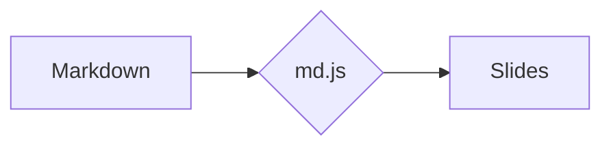

# MDECK — Markdown slide decks for the web

Zero-build, 100% static presentation engine (HTML + CSS + JavaScript). Each presentation is a **folder**, each slide is a **Markdown file**. Serve it from any static host — GitHub Pages, an intranet share, `python -m http.server` — and it just works.

- ✍️ **Write slides in plain Markdown** — one `.md` file per slide, versioned in git like the rest of your code
- 🚀 **No build step, no dependencies to install** — markdown-it and highlight.js are vendored locally, so it works fully offline / on intranets, no CDN required
- 🗂️ **Library home page with collections** — group decks by topic, course, or team
- 🎨 **Opinionated, polished look — and fully themeable** — override colors & fonts per deck from `presentation.json` (see [Theming](#theming-colors--fonts)); accent colors, dark mode, layout containers (grids, cards, stats)
- 🖥️ **Presenter-friendly** — keyboard navigation, overview grid, fullscreen, touch swipe, click-to-zoom on images, deep links to any slide, print-to-PDF export
- 🔌 **Embeddable engine** — keep your content in a separate (even private) repo and load the engine from a CDN

This repo ships the **engine** plus **bundled demos**: a feature tour (`demo/`) and two sample decks that show themed, real-world content. For your own material, keep a separate content repo and load the engine from a CDN — see [Embedding](#embedding-using-the-engine-from-another-repo).

Markdown is rendered with [markdown-it](https://github.com/markdown-it/markdown-it) (CommonMark + GFM tables + linkify) and code is highlighted with [highlight.js](https://highlightjs.org/) — both **vendored locally** in `assets/vendor/`. `assets/md.js` is just a thin adapter that adds per-slide frontmatter and `:::` containers.

## Structure

```
mdeck/
├── index.html                  # home page (the presentation library)
├── deck.html                   # universal viewer: deck.html?p=<folder>
├── assets/
│   ├── mdeck.js                # single entry point — loads the right module
│   ├── style.css               # visual identity + home page
│   ├── deck.css                # viewer styles
│   ├── home.js                 # home page module (loaded by mdeck.js)
│   ├── deck.js                 # viewer module (loaded by mdeck.js)
│   ├── md.js                   # Markdown adapter (frontmatter, containers, icons, math)
│   └── vendor/                 # markdown-it, highlight.js, mermaid, katex, medium-zoom (local)
├── presentations/
│   ├── index.json              # list / collections of presentations
│   ├── demo/                   # feature tour — layouts, syntax, diagrams, math
│   ├── olive-oil/              # sample deck (custom theme)
│   └── dev-to-farmer/          # sample deck (custom theme)
└── .claude/skills/mdeck-deck/  # Claude Code skill for authoring decks (see below)
```

## Getting started

Markdown files are loaded via `fetch()`, so the page must be served over HTTP (not opened directly via `file://`):

```powershell
python -m http.server 8080
# or
npx serve .
```

Then open **http://localhost:8080**.

## Embedding (using the engine from another repo)

A content repo only needs the presentations plus two thin HTML pages that load the engine from here. Assets can be served straight from GitHub via [jsDelivr](https://www.jsdelivr.com/):

```
https://cdn.jsdelivr.net/gh/ovidiuchis/mdeck@main/assets/...
```

Structure of a content repo:

```
content-repo/
├── index.html        # thin copy — CSS/JS from CDN
├── deck.html         # thin copy — CSS/JS from CDN
└── presentations/
    ├── index.json
    └── my-presentation/...
```

The engine has a **single entry point** — `mdeck.js`. It detects the page's role (deck viewer vs. home library) and loads the matching module, which then self-bootstraps: injects the stylesheets and fonts, loads its own dependencies (markdown-it, highlight.js) and builds the chrome. So a content repo's `deck.html` is just one script:

```html
<!DOCTYPE html>
<html lang="en">
<head>
  <meta charset="UTF-8">
  <meta name="viewport" content="width=device-width, initial-scale=1.0">
  <title>Presentation</title>
  <!-- set the dark theme before first paint, to avoid a flash -->
  <script>
    try {
      const t = new URLSearchParams(location.search).get("theme") || localStorage.getItem("mdeck-theme");
      if (t === "dark") document.documentElement.classList.add("dark");
    } catch (e) {}
  </script>
  <script>
    window.MDECK = {
      root: "presentations/",   // presentations folder (default)
      home: "index.html",       // home page (default)
      author: "Jane Doe",       // signature on the first/last slide (default: none)
      monogram: "JD",           // signature monogram (default: author's initials)
      languages: ["powershell"],// extra highlight.js language files to load (default: none)
      strings: {                // UI text overrides (default: English)
        homeTitle: "Înapoi la lista de prezentări",
        navPrev: "Slide anterior (←)"
        // see the STR tables in home.js / deck.js for all keys
      }
    };
  </script>
  <script src="https://cdn.jsdelivr.net/gh/ovidiuchis/mdeck@main/assets/mdeck.js"></script>
</head>
<body></body>
</html>
```

The home page (`index.html`) uses the **same** `mdeck.js` script — it just needs a `<main id="decks"></main>` somewhere, which is how the engine recognizes a home page and renders the card grid into it. Everything else on that page (your header, hero, footer) is yours to design; the engine injects the stylesheet/fonts but won't touch your markup. Put the script after the `<main id="decks">` element, or set `window.MDECK = { page: "home" }` to be explicit.

> The engine still works with the older, verbose HTML (where every `assets/...` link and script is spelled out): if it detects that the page already provides the chrome and dependencies, it skips the bootstrap. New pages should use the single `mdeck.js` form above.

Complete example of a content repo: [oc-prezentari](https://github.com/ovidiuchis/oc-prezentari).

> **Note:** jsDelivr caches `@main` for up to 12 hours. For stable releases, reference a tag or a commit: `...@v1.0/assets/...`.

Alternatives to the CDN: include this repo as a **git submodule** (relative references `mdeck/assets/...`) or simply **copy** the `assets/` folder.

## Adding a new presentation

1. Create a new folder in `presentations/`, e.g. `presentations/intro-git/`.
2. Add a `presentation.json`:

```json
{
  "title": "Introduction to Git",
  "description": "Version control for beginners.",
  "accent": "purple",
  "tags": ["Git", "Course"],
  "slides": ["01-title.md", "02-concepts.md", "03-final.md"]
}
```

3. Write the slides as `.md` files (see the syntax below).
4. Add the folder name to `presentations/index.json` — either in the flat `presentations` list or inside a collection (see below).

Done — it shows up automatically on the home page.

### The home-page card

On the home page each deck appears as a **card** built entirely from `presentation.json` — **not** from the first slide. The card shows:

- `title` — the card heading;
- `description` (with `subtitle` as a fallback) — the line of text under the title;
- `tags` — the chips along the bottom;
- the slide count (`Presentation · N slides`, from `slides.length`) and an *Open →* link.

The card also adopts the deck's identity so the library previews each presentation's look: its `accent` (the stripe/label color) and, if present, the `theme`'s `primary`/`accent` colors and `fonts` (see [Theming](#theming-colors--fonts)). It deliberately keeps the home page's own `surface`/`bg`/`text`, so dark mode stays consistent across cards.

So to control how a deck looks in the list, edit those `presentation.json` fields — the title slide (`01-…md`) is independent.

## Collections

Presentations can be grouped on the home page into **collections** (e.g. "Internship 2026", "Company general"). In `presentations/index.json`:

```json
{
  "collections": [
    {
      "title": "Internship 2026",
      "description": "Materials for the internship program.",
      "presentations": ["intro-git", "intro-sql"]
    },
    {
      "title": "Company general",
      "presentations": ["onboarding"]
    }
  ]
}
```

- `title` — the collection name, shown as a section header; `description` is optional.
- The order of collections and of the presentations inside them is the display order.
- The old format still works: a plain `{ "presentations": ["demo"] }` renders all cards in a single grid, without headers. The two can be combined — presentations in the flat `presentations` list are shown at the end, without a collection title.

## Theming (colors & fonts)

The whole look is driven by CSS custom properties, so a deck can rebrand itself **without touching the engine** — just add an optional `theme` block to its `presentation.json`:

```json
{
  "title": "Quarterly review",
  "accent": "#c0392b",
  "theme": {
    "colors": {
      "primary": "#c0392b",
      "accent":  "#e0a800",
      "bg":  "#faf7f0",
      "surface": "#ffffff",
      "text":   "#1a1a1a"
    },
    "fonts": {
      "display": "Fraunces",
      "sans":    "Inter",
      "mono":    "JetBrains Mono"
    },
    "googleFonts": "Fraunces:wght@700;900&family=Inter:wght@400;600&family=JetBrains+Mono:wght@400;500"
  },
  "slides": ["01-title.md", "..."]
}
```

How it works:

- **`colors`** — each key maps directly to a CSS variable `--<key>` (see `:root` in `assets/style.css`). The most useful keys: `primary` (titles, links, default accent), `accent` (underlines, text selection), `bg` (page background), `surface` (cards/surfaces), `text` (body text). Others: `text-soft`, `text-muted`, `line`, `line-soft`, `swatch-blue`, `swatch-red`, `swatch-green`, `swatch-purple`, `swatch-sky`, `code-bg`, `title-bg`.
- **`fonts`** — `display` (headings), `sans` (body), `mono` (code). A bare name is wrapped with sensible fallbacks; you can also pass a full font stack.
- **`googleFonts`** — optional; the part after `family=` in a [Google Fonts](https://fonts.google.com/) URL. It's loaded automatically. If you self-host or use system fonts, omit it.
- Overrides apply via an injected `:root` rule, so the built-in **dark theme (`D` key) keeps working** — `html.dark` stays more specific for the colors it redefines.
- The **home page previews each deck's theme**: a deck's card adopts its accent, primary/accent colors and fonts, so the library shows each presentation in its own identity.

**Accent as a free value** — `accent` (in `presentation.json` or per-slide frontmatter) accepts either a palette name (`primary | gold | blue | red | green | purple | sky`) **or** a literal color: `#c0392b`, `rgb(...)`, `hsl(...)`, `var(--accent)`.

### Ready-made themes

Drop the `theme` block (and matching `accent`) from any of these into your `presentation.json`:

**Crimson** — editorial red, serif headings

```json
"accent": "#b8302a",
"theme": {
  "colors": { "primary": "#b8302a", "accent": "#d99000", "bg": "#faf6f0", "text": "#211a18" },
  "fonts":  { "display": "Fraunces", "sans": "Inter" },
  "googleFonts": "Fraunces:wght@700;900&family=Inter:wght@400;600"
}
```

**Forest** — deep green on warm cream

```json
"accent": "#1f7a4d",
"theme": {
  "colors": { "primary": "#1f7a4d", "accent": "#caa23a", "bg": "#f3f1e7", "surface": "#fffdf6", "text": "#1b231d" },
  "fonts":  { "display": "Bricolage Grotesque", "sans": "Inter" },
  "googleFonts": "Bricolage+Grotesque:wght@700;800&family=Inter:wght@400;600"
}
```

**Slate** — calm corporate blue-grey

```json
"accent": "#2b6cb0",
"theme": {
  "colors": { "primary": "#2b6cb0", "accent": "#3aa0a0", "bg": "#f4f6f9", "surface": "#ffffff", "text": "#1a2230" },
  "fonts":  { "display": "Manrope", "sans": "Manrope", "mono": "JetBrains Mono" },
  "googleFonts": "Manrope:wght@400;600;800&family=JetBrains+Mono:wght@400;500"
}
```

**Sunset** — warm orange & magenta

```json
"accent": "#e8590c",
"theme": {
  "colors": { "primary": "#e8590c", "accent": "#d6336c", "bg": "#fbf3ec", "text": "#241a17" },
  "fonts":  { "display": "Space Grotesk", "sans": "Space Grotesk" },
  "googleFonts": "Space+Grotesk:wght@400;500;700"
}
```

**Mono** — high-contrast black & white, typographic

```json
"accent": "#111111",
"theme": {
  "colors": { "primary": "#111111", "accent": "#111111", "bg": "#ffffff", "surface": "#ffffff", "text": "#0a0a0a" },
  "fonts":  { "display": "Archivo", "sans": "Inter", "mono": "IBM Plex Mono" },
  "googleFonts": "Archivo:wght@800;900&family=Inter:wght@400;600&family=IBM+Plex+Mono:wght@400;500"
}
```

The built-in default is **Klein** — ultramarine `#2033c4` & gold `#eab438`, with Archivo / Space Grotesk / IBM Plex Mono. Leave out the `theme` block to keep it.

## Slide syntax

A slide = one Markdown file, optionally with frontmatter:

```markdown
---
layout: title        # title | section | center | default | quote | full-image | end
accent: primary      # palette name OR a literal color (#c0392b, rgb(), hsl(), var(--accent))
image: cover.jpg     # only for layout: full-image (path relative to the deck folder)
---

###### Small label above the title (eyebrow)

## Slide title

Regular text, **bold**, *italic*, `inline code`, [links](https://...).

- bullet lists
1. numbered lists

> Highlighted quotes

| Tables | Supported |
|--------|-----------|
| yes    | of course |
```

### Code blocks with highlighting

````markdown
```sql
SELECT Name, City FROM Customers WHERE City = 'Cluj-Napoca';
```
````

The usual languages ship with highlight.js (sql, js/ts, python, bash, json, html, css, c#, java...). For extras — PowerShell, for example — drop the language file from highlight.js into `assets/vendor/languages/` and list it in the config: `window.MDECK = { languages: ["powershell"] }`. The engine then loads it on demand.

### Layout containers (grids, cards, stats)

```markdown
::: grid 3
::: card blue
### Card title
Card content.
:::
::: card primary
### Another card
- lists work too
:::
::: stat purple
## 250+
The stat label
:::
:::
```

`grid 2|3|4` creates equal columns; `grid 1-2` (or `1-2-1`, …) sets proportional widths; `card <accent>` a colored card; `stat <accent>` a big number with a label. Each empty `:::` closes the current container.

### More containers

```markdown
::: split            # two halves, vertically centered (text next to media)
::: col
Left side — text, lists, anything.
:::
::: col

:::
:::

::: columns 2        # body text flowing across 2 (or 3) newspaper columns
Long reference text…
:::

::: timeline         # a vertical timeline, built from a list
- **Step one.** Description.
- **Step two.** Description.
:::

::: steps            # numbered step cards, side by side (from an ordered list)
1. **Create** the folder.
2. **Write** the slides.
3. **Present.**
:::

::: callout info     # note boxes: info | tip | ok | warn
**Heads up:** serve over HTTP, not file://.
:::
```

### Inline extras

- **Icons** — `:check:` `:star:` `:zap:` `:rocket:` `:bulb:` `:info:` `:alert:` `:heart:` `:clock:` `:users:` `:lock:` `:chart:` `:flag:` `:mail:` `:calendar:` `:target:` `:globe:` `:code:` `:database:` `:leaf:` (Feather-style SVGs, colored with the slide accent). Unknown `:names:` are left untouched.
- **Keys** — `[[Ctrl]]` `[[Space]]` `[[→]]` render as styled `<kbd>` chips.

### Diagrams and math

Both libraries are vendored locally and **loaded on demand** — decks that don't use them stay lean.

````markdown

````

```markdown
Inline math like $e^{i\pi}+1=0$ and display blocks:

$$ \sigma = \sqrt{\tfrac{1}{N}\sum (x_i-\mu)^2} $$
```

Math is rendered with [KaTeX](https://katex.org/); `$…$` is inline, `$$…$$` is a display block. Dollar signs inside code (`` `$VAR` `` or fenced blocks) are ignored.

## Navigating a presentation

| Key / gesture | Action |
|---------------|--------|
| `→` `↓` `Space` `PgDn` / click (empty area) | next slide |
| click on an image | zoom in (Esc or click again to close) |
| `←` `↑` `PgUp` | previous slide |
| `Home` / `End` | first / last slide |
| `F` | fullscreen |
| `H` | back to the presentation list (Home) |
| `D` | toggle dark / light theme (remembered in the browser) |
| `G` or `O` | overview (grid with all slides) |
| `P` | export to PDF (opens the browser print dialog) |
| `Esc` | close the overview or image zoom |
| swipe left / right | next / previous slide (touch) |
| pinch out / in | zoom a region in / out (touch) |
| tap | next slide, and reveal the toolbar (touch) |

Every slide has its own URL (`deck.html?p=demo#3`) — you can link directly to a slide.

## Printing / PDF export

Press **`P`** (or click the **⤓** button in the toolbar) to open the browser's print dialog, then choose **Save as PDF**. The engine sizes each page to the exact 16:9 slide (`1280×720`), so you get **one slide per page, edge-to-edge, with no margins** — backgrounds, colored callouts, code highlighting and Mermaid/KaTeX are all preserved. The result is a clean file you can attach to an email.

Tips for the print dialog:

- **Destination:** *Save as PDF*
- **Margins:** *None* (the engine already removes them via `@page`)
- **Background graphics:** *On* — usually on by default; turn it on if the title/section slides come out white.
- The `P` shortcut waits for diagrams and formulas to finish rendering before opening the dialog, so they always make it into the PDF.

## Authoring with Claude Code (bundled skill)

This repo ships a [Claude Code](https://claude.com/claude-code) skill at [`.claude/skills/mdeck-deck/`](.claude/skills/mdeck-deck/) that teaches the agent the full slide syntax — layouts, `:::` containers, icons, `kbd`, Mermaid, KaTeX — plus the authoring rules (the fixed 1280×720 stage, one idea per slide) and a copy-ready `template/` deck.

If you clone this repo, the skill is picked up automatically: just ask Claude Code things like *"make a deck about X"* or *"add a slide with a timeline"* and it follows the MDECK conventions.

If you keep your content in a **separate repo** that embeds the engine, copy the skill folder into your project so the agent has it there too:

```bash
mkdir -p .claude/skills
cp -r path/to/mdeck/.claude/skills/mdeck-deck .claude/skills/
```

It's plain Markdown — feel free to trim or adapt it to your own deck conventions.
