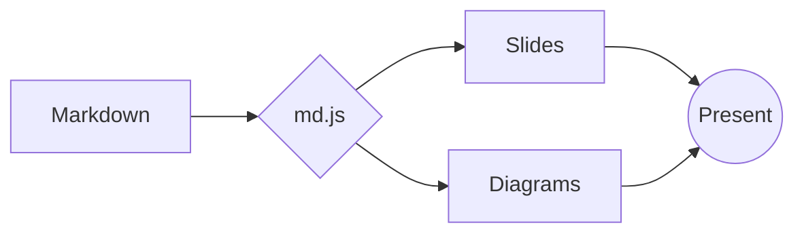

###### Rich content · diagrams

## Diagrams from plain text

Fenced ` ```mermaid ` blocks render as diagrams — the library is loaded only when a slide needs it. :zap:


```mermaid
flowchart LR
  A[Markdown] --> B{md.js}
  B --> C[Slides]
  B --> D[Diagrams]
  C --> E((Present))
  D --> E
```
